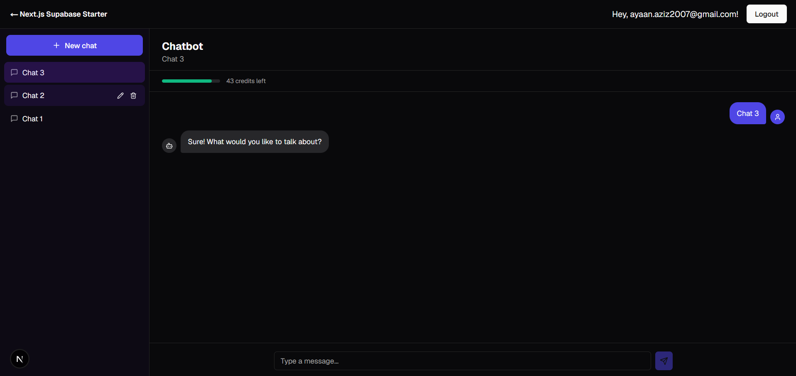

# Chatbot + Credits System

A credit-metered AI chatbot built on the [Next.js Supabase starter](https://github.com/vercel/next.js/tree/canary/examples/with-supabase). Adds a `/chatbot` route with a multi-conversation chat interface, backed by a per-user credit system that persists across sessions and devices.

---



---

## Features

- **Streaming chat** — replies render token-by-token as they're generated, backed by Groq
- **Multi-conversation sidebar** — create, rename, and delete chats; full message history persists per conversation
- **Markdown rendering** — bot replies support formatted text, lists, links, and code blocks
- **Per-user credit system** — every message deducts one credit; balance is stored in Postgres, not local state
- **Live cross-device sync** — credit balance updates in real time across every open tab/device via Supabase Realtime, no refresh required
- **Daily credit refill** — balances reset to 50 automatically at midnight UTC via a scheduled Postgres job
- **Auth-gated** — built on the starter's existing Supabase Auth (cookie-based sessions); unauthenticated users are redirected to log in

## Architecture

**Stack:** Next.js (App Router) · TypeScript · Tailwind CSS · Supabase (Auth, Postgres, Row Level Security, Realtime, pg_cron) · Groq (inference)

### Request flow

A message goes through the following path:

```
Browser (Client Component)
  → POST /api/chat
    → Verify session (Supabase Auth, via cookies)
    → Fetch prior messages for context
    → Atomically decrement credits (Postgres RPC)
    → Stream reply from Groq, token-by-token
    → Persist user + bot messages to Postgres
  ← NDJSON stream (metadata, then tokens, then done)
Browser renders tokens live, syncs credit count
```

Credit changes are also broadcast independently via a Supabase Realtime subscription, so any other open tab or device reflects the new balance immediately — not only the tab that sent the message.

### Database schema

| Table | Purpose | Key columns |
|---|---|---|
| `credits` | One row per user; current balance | `user_id`, `credits_count`, `user_email` |
| `chat_conversations` | One row per chat thread | `id`, `user_id`, `title`, `updated_at` |
| `chat_messages` | Every message, linked to a conversation | `conversation_id`, `role`, `content` |

All tables use Row Level Security — a user can only ever read or write rows tied to their own `user_id`, enforced by Postgres itself. Credit deduction runs through a single atomic SQL function (`decrement_credit`) to prevent race conditions when multiple requests land close together.

### File structure

```
app/
├── chatbot/
│   ├── layout.tsx        # Full-height shell: nav bar + sidebar/main split
│   └── page.tsx          # Auth check, initial data fetch
├── api/
│   ├── chat/route.ts             # Streaming chat endpoint + credit deduction
│   └── conversations/
│       ├── route.ts              # List conversations
│       └── [id]/
│           ├── route.ts          # Rename / delete
│           └── messages/route.ts # Fetch message history

components/chatbot/
├── chatbot-shell.tsx      # Client-side state, Realtime subscription
├── sidebar.tsx            # Conversation list, new/rename/delete
└── chat.tsx               # Message list, streaming, markdown rendering

lib/
├── chatbot/reply.ts       # Groq streaming client
└── supabase/
    ├── client.ts          # Browser-side Supabase client
    └── server.ts          # Server-side Supabase client (cookie-based)

supabase/migrations/       # SQL: tables, RLS policies, RPC functions, cron job
```

## Getting Started

### 1. Clone and install

```bash
git clone https://github.com/notayannn/Supabase-ChatBot
cd chatbot-app
npm install
```

### 2. Configure environment variables

Copy the example file and fill in your Supabase project credentials (**Project Settings → API** in the Supabase dashboard):

```bash
cp .env.example .env.local
```

```env
NEXT_PUBLIC_SUPABASE_URL=
NEXT_PUBLIC_SUPABASE_PUBLISHABLE_KEY=
GROQ_API_KEY=
```

### 3. Set up the database

In the Supabase **SQL Editor**, run the migration scripts in `supabase/migrations/` in order. These create the `credits`, `chat_conversations`, and `chat_messages` tables, their RLS policies, the atomic credit-decrement function, the daily refill job (`pg_cron`), and enable Realtime on the `credits` table.

### 4. Run locally

```bash
npm run dev
```

Visit `http://localhost:3000`, sign up, and navigate to `/chatbot`.
